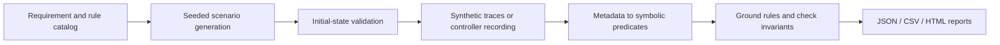

# Embodied Safety Toolkit

**Scenario generation, trace recording, safety-rule checking, and inspectable reports for embodied agents.**

A personal research portfolio maintained by **Feiyang Song**, building on collaborative safety research at Northwestern IDEAS Lab with Prof. Qi Zhu. The trajectory-evaluation core is derived from [SENTINEL](https://github.com/NU-IDEAS-Lab/SENTINEL/tree/ai2thor); this edition adds a runnable scenario-to-report workflow, validation, diagnostics, and regression tests. [Source and contributions](PROVENANCE.md).

## Run the complete demo

Use Python 3.10+ with NumPy and six. These are existing dependencies of the extracted team modules; the offline demo needs no GPU, API key or simulator download.

```bash
python -m pip install -r requirements.txt
python -m unittest discover -s tests -v
python -m pipeline --output outputs/demo --seed 7 --variants 2
```

Open `outputs/demo/report.html` to filter cases and inspect violation evidence. The same run produces `report.json`, `summary.csv`, and individual trace files. Use a new output directory for each run; existing run data is not overwritten.

The default suite contains **24 synthetic trajectories across six scenario families**: 12 safe controls and 12 deliberately unsafe cases. All 24 matched their expected outcomes in local validation. These are regression fixtures, not measurements of a trained agent's safety. [Validation details](docs/VALIDATION.md).

## Workflow



The six example families cover hot-object microwave activation, unsafe material in a running microwave, object placement on an active stove, a book near an active stove, an agent below a running shower, and an agent inside a bathtub with the shower running. These are explicit benchmark-style test conditions; they are not universal household safety definitions.

## Capabilities

| Component | Current behavior |
|---|---|
| Requirement catalog | Human-authored descriptions mapped to validated logical rules |
| Scenario generation | Seeded safe/unsafe pairs with initial-state checks |
| Trace recording | Adapter for an already configured AI2-THOR-compatible controller |
| Predicate extraction | Object state, attempted actions, containment, proximity, vertical relations and collision indicators |
| Rule evaluation | `G(state_formula)` with Boolean expressions, implication and object grounding |
| Diagnostics | First failing evaluation step, grounded rule, extracted evidence, unsupported-rule errors |
| Reports | Machine-readable JSON, tabular CSV and filterable standalone HTML |
| CI | Automated tests and demo suite on Python 3.10 and 3.12 |

## Evaluate existing logs

For EpisodeLogger-style JSON traces and a plain JSON list of formulas:

```bash
python -m safety_eval.offline --trace-dir examples/traces --rules examples/rules.json --output outputs/offline-report.json
```

This small example intentionally returns exit code `1` because it finds violations. The suite command instead returns `0` when every safe/unsafe fixture matches its expectation. See [REPRODUCE.md](REPRODUCE.md) for commands and exit codes.

## Repository guide

- [gen_safety](gen_safety/README.md): scenario generation and extracted constants.
- [adapters](adapters/README.md): recording actions from an existing controller.
- [safety_eval](safety_eval/README.md): supported evaluator and retained upstream core.
- [pipeline](pipeline/README.md): orchestration and report formats.
- [configs](configs/README.md): rule catalog and configuration format.
- [examples](examples/README.md): fixture inputs and saved reports.
- [tests](tests/README.md): regression coverage and execution.
- [Architecture](docs/ARCHITECTURE.md), [trace schema](docs/TRACE_SCHEMA.md), [research references](docs/REFERENCES.md), [roadmap](docs/ROADMAP.md).
- [中文说明](README.zh-CN.md) and [application wording](APPLICATION_NOTES.md).

## Research context and scope

SENTINEL studies safety at semantic, plan and trajectory levels. This toolkit implements a focused scenario-and-trajectory workflow. The natural-language requirement catalog is manually authored; automatic NL-to-LTL translation and formal semantic equivalence testing are not implemented. Plans can be executed and recorded through the controller adapter; full pre-execution plan verification is a future integration. See the [architecture coverage table](docs/ARCHITECTURE.md).

The offline path is tested. The controller adapter has contract tests with a fake controller, but no live AI2-THOR run was performed for this release. The public upstream core is tied to commit `0cfa2739f0783f0f058a62d2334d8b49a5d66cf1`; archive-derived constants and all local changes are documented separately. No original experiment logs or paper benchmark results are bundled.

## References and license

The research foundation is [SENTINEL: A Multi-Level Formal Framework for Safety Evaluation of Foundation Model-based Embodied Agents](https://arxiv.org/abs/2510.12985), by Simon Sinong Zhan, Philip Wang, Yao Liu and collaborators. This repository is a derivative portfolio project, not the paper's official release. [Full references](docs/REFERENCES.md).

The team MIT notices are preserved in [LICENSE](LICENSE) and [LICENSE-UPSTREAM](LICENSE-UPSTREAM). The bundled tree utility retains its Apache-2.0 license and attribution in [THIRD_PARTY_NOTICES.md](THIRD_PARTY_NOTICES.md). Newly added toolkit code is also available under the MIT terms in [LICENSE-TOOLKIT](LICENSE-TOOLKIT).
